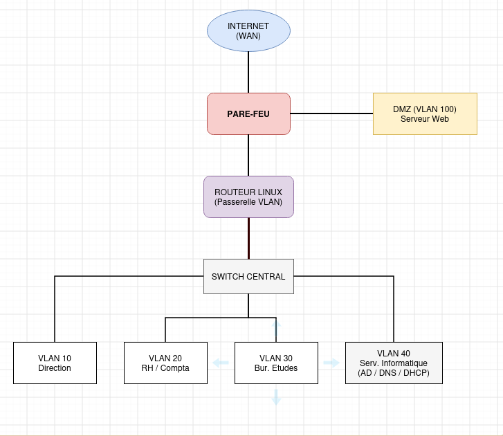

# AP3-SIO2

[Réseau & VLANs](https://github.com/h3nr1-art/ap3-sio2/blob/main/R%C3%A9seau%20%26%20VLANs)  
[Contrôleur de domaine & DFS](https://github.com/h3nr1-art/ap3-sio2/blob/main/Contr%C3%B4leur%20de%20domaine%20%26%20DFS)  
[Cloud privé & DMZ](https://github.com/h3nr1-art/ap3-sio2/blob/main/Cloud%20priv%C3%A9%20%26%20DMZ)  
[Cluster WEB + load balancer](https://github.com/h3nr1-art/ap3-sio2/blob/main/Cluster%20WEB%20%2B%20load%20balancer)  

## Schema logique

## Plan adressage ip

| Services                     | Adresse réseau   | Masque          | Broadcast     | Gateway       |
| ---------------------------- | ---------------- | --------------- | ------------- | ------------- |
| Service informatique         | 192.168.1.1/27   | 255.255.255.224 | 192.168.1.32  | 192.168.1.31  |
| R&D                          | 192.168.1.33/28  | 255.255.255.240 | 192.168.1.48  | 192.168.1.47  |
| Atelier                      | 192.168.1.49/28  | 255.255.255.240 | 192.168.1.64  | 192.168.1.63  |
| Compta                       | 192.168.1.65/28  | 255.255.255.240 | 192.168.1.80  | 192.168.1.79  |
| Finance                      | 192.168.1.81/28  | 255.255.255.240 | 192.168.1.96  | 192.168.1.95  |
| Direction                    | 192.168.1.97/28  | 255.255.255.240 | 192.168.1.112 | 192.168.1.111 |
| RH                           | 192.168.1.113/28 | 255.255.255.240 | 192.168.1.128 | 192.168.1.127 |
| Salle Serveur                | 192.168.1.129/28 | 255.255.255.240 | 192.168.1.144 | 192.168.1.143 |
| Imprimante RH/Compta         | 192.168.1.145/29 | 255.255.255.248 | 192.168.1.152 | 192.168.1.151 |
| Imprimante Finance/direction | 192.168.1.153/29 | 255.255.255.248 | 192.168.1.160 | 192.168.1.159 |
| Entrepôt                     | 192.168.1.161/29 | 255.255.255.248 | 192.168.1.168 | 192.168.1.167 |
| Magasin 1                    | 192.168.2.0/29   | 255.255.255.248 | 192.168.2.7   | 192.168.2.6   |
| Magasin 2                    | 192.168.3.0/29   | 255.255.255.248 | 192.168.3.7   | 192.168.3.6   |
| Magasin 3                    | 192.168.4.0/29   | 255.255.255.248 | 192.168.4.7   | 192.168.4.6   |
| Magasin 4                    | 192.168.5.0/29   | 255.255.255.248 | 192.168.5.7   | 192.168.5.6   |
| Magasin 5                    | 192.168.6.0/29   | 255.255.255.248 | 192.168.6.7   | 192.168.6.6   |
| Magasin 6                    | 192.168.7.0/29   | 255.255.255.248 | 192.168.7.7   | 192.168.7.6   |
| Magasin 7                    | 192.168.8.0/29   | 255.255.255.248 | 192.168.8.7   | 192.168.8.6   |
| Magasin 8                    | 192.168.9.0/29   | 255.255.255.248 | 192.168.9.7   | 192.168.9.6   |
| Magasin 9                    | 192.168.10.0/29  | 255.255.255.248 | 192.168.10.7  | 192.168.10.6  |
| Magasin 10                   | 192.168.11.0/29  | 255.255.255.248 | 192.168.11.7  | 192.168.11.6  |
| Magasin 11                   | 192.168.12.0/29  | 255.255.255.248 | 192.168.12.7  | 192.168.12.6  |
| Magasin 12                   | 192.168.13.0/29  | 255.255.255.248 | 192.168.13.7  | 192.168.13.6  |
| Magasin 13                   | 192.168.14.0/29  | 255.255.255.248 | 192.168.14.7  | 192.168.14.6  |
| Magasin 14                   | 192.168.15.0/29  | 255.255.255.248 | 192.168.15.7  | 192.168.15.6  |
| Magasin 15                   | 192.168.16.0/29  | 255.255.255.248 | 192.168.16.7  | 192.168.16.6  |
| Magasin 16                   | 192.168.17.0/29  | 255.255.255.248 | 192.168.17.7  | 192.168.17.6  |
